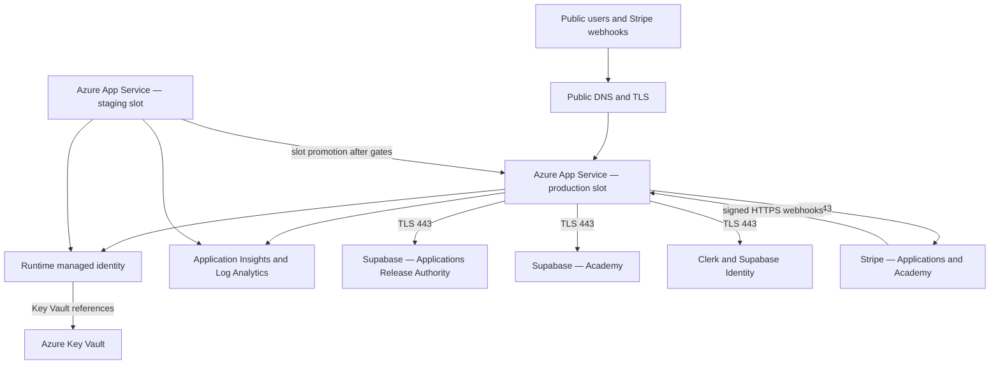
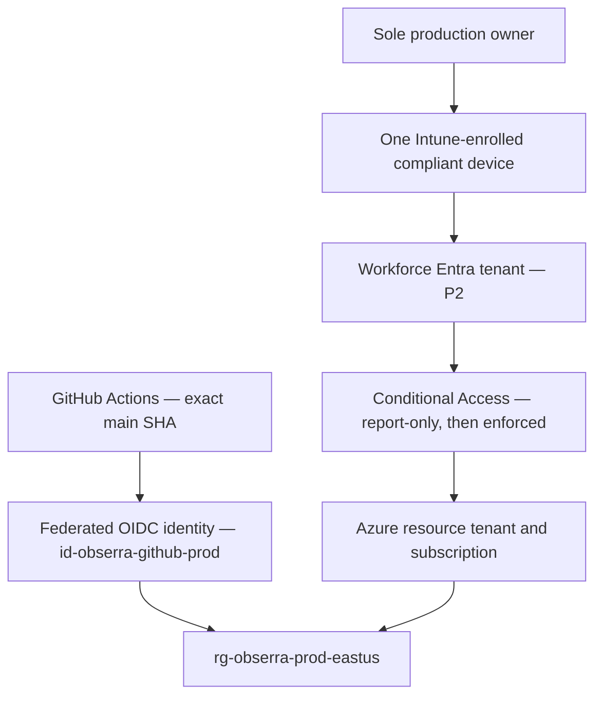
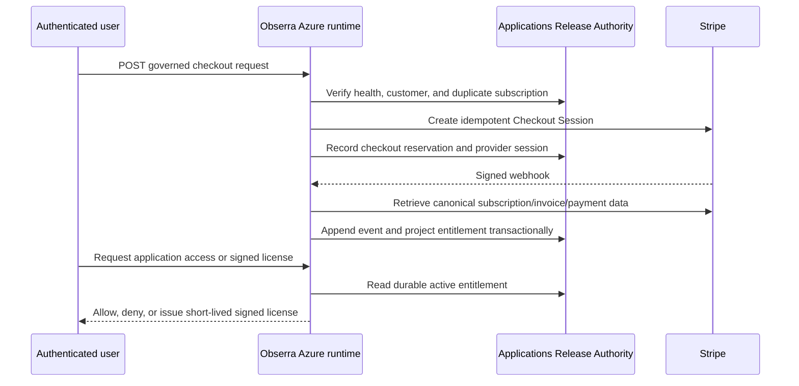

# Obserra production network and identity architecture

Status date: 2026-08-22

Production owner: Obserra Executive Protection & Intelligence LLC

Public cutover state: **BLOCKED — the public website remains on Vercel until an exact-Git-SHA Azure staging deployment passes every acceptance gate below.**

This document separates verified current state, implemented source controls, target runtime topology, and owner-only actions. It must not be used as evidence that Azure, Entra, Intune, Stripe, Clerk, or DNS changes have already run.

## Current and target state

| Plane | Verified current state | Implemented control | Remaining production gate |
|---|---|---|---|
| Public delivery | `www.obserrallc.com` was audited on a stale Vercel production release | Azure App Service production/staging slot deployment and exact-SHA workflow | Deploy staging, pass health/security/commerce/LMS gates, bind TLS/custom domain, then change DNS |
| Resource administration | Azure subscription `38d660ff-611e-4f6c-ad29-70f5cf118f52`, resource tenant `7d8b7b64-c80c-4c8a-a514-66f6b1cf8607`, region `eastus` | GitHub OIDC user-assigned identity `id-obserra-github-prod`; Bicep-managed App Service, runtime identity, Key Vault, Log Analytics, Application Insights | Execute Bicep and retain deployment/resource/RBAC evidence |
| Workforce identity | Workforce tenant `5a08a33a-d2b5-491d-ac6d-32f325138143`, Entra ID P2, Intune available, two directory users shown, zero enrolled devices shown | Idempotent owner-only group, one-seat Intune assignment, Windows compliance policy, report-only Conditional Access automation | Owner delegated consent; verify group membership; enroll one device; prove compliance and recovery before enforcement |
| Public identity | Clerk and Supabase Identity are application identity systems; public customers are outside Intune scope | Azure runtime requires Clerk/Supabase identity readiness | Load Key Vault values and prove sign-in/session/authorization flows on staging |
| Applications data | Applications Release Authority Supabase project `ykmrlcfitsubqajgfnye` is operational with durable commerce ledger controls | Private forced-RLS tables, append-only event ledger, scoped security-definer RPCs, signed webhook and governed price validation | Load runtime credentials; run controlled live purchase/refund/dispute/revocation evidence |
| Academy data | Academy Supabase project `nwxnyqlyzyufgoadtqxs` is operational | Azure release blocks the prior `503` commerce-health state | Load Academy runtime values and prove enrollment/payment/entitlement/revocation |
| Other regulated data | Supabase Identity `ftkjhmtfyfkartfsnkjb`; FDACS `ggkxgjhsbgbifiqrhavr`; EIOS `rroqnbfqwurmjipdcluj` | Runtime endpoints are explicit; server credentials use Key Vault references | Verify data classification, least privilege, backups, restoration, and provider egress evidence per system |
| Payments | No controlled live transaction was fabricated | Dedicated Applications Stripe secret/webhook, immutable price catalog, idempotent Checkout, durable customer/subscription/event mapping | Configure live restricted key, prices, webhook, tax/policy decisions, and execute reconciled acceptance run |
| Edge/WAF | No Azure Front Door/WAF deployment is evidenced | Direct App Service HTTPS/TLS 1.2, FTPS disabled, health probe, slot-based release | Owner must approve direct App Service risk or fund/implement Front Door Premium + WAF before DNS cutover |

## Target runtime topology



The application uses provider-managed public endpoints over TLS. The current Bicep does not claim private endpoints, a VNet, NAT Gateway, Azure Firewall, or Front Door. Those controls must not appear in diagrams or audit evidence until deployed and verified.

## Deployment and administrative trust paths



The workforce tenant and Azure resource tenant are different security boundaries. Intune applies only to the owner workforce account and owner device. It must not be applied to public website customers, Academy learners, or marketplace users.

## Payment and entitlement connection



Acceptance requires replay, duplicate-event, delayed-event, refund, dispute, cancellation, stale-price, wrong-product, wrong-mode, and signature-failure tests. Stripe Dashboard state alone is not the entitlement authority.

## Inbound and outbound rules

| Direction | Source | Destination | Protocol | Required control |
|---|---|---|---|---|
| Inbound | Public users | Azure public hostname/custom domain | HTTPS 443 | TLS 1.2+, HTTP-to-HTTPS redirect, security headers, rate limits at application/edge, health path does not expose secrets |
| Inbound | Stripe | `/api/webhook/stripe-applications` and Academy webhook | HTTPS 443 | Raw-body signature verification, 1 MiB body limit, live/test mode match, append-only idempotency |
| Inbound admin | Owner compliant device | Azure/Entra/Intune admin portals | HTTPS 443 | Entra MFA + compliant device; report-only until owner recovery is proven |
| Deployment | GitHub Actions | Azure Resource Manager/Kudu | HTTPS 443/OIDC | No client secret; exact repository/ref/environment federated credential; least-privilege Azure roles |
| Outbound | App Service | Key Vault | HTTPS 443 | Runtime managed identity and Key Vault RBAC; no secret in source/logs |
| Outbound | App Service | Supabase projects | HTTPS 443 | Server-only service credentials; forced RLS/private schema/scoped RPC controls |
| Outbound | App Service | Clerk/Stripe/Daily/OpenAI as enabled | HTTPS 443 | Dedicated credentials, bounded timeouts, retry/idempotency, fail closed for authorization/payment |
| Telemetry | App Service | Application Insights/Log Analytics | HTTPS 443 | No payment secrets, service keys, license secrets, or regulated payloads in logs |

Intune enrollment also requires the Microsoft service endpoints published for the tenant and platform. The enrollment script verifies the critical enrollment hostname before launching Windows MDM enrollment; a final enterprise firewall allowlist must be generated from Microsoft's current endpoint documentation at execution time.

## Resource ownership and separation

| Identity | Purpose | Required access | Prohibited access |
|---|---|---|---|
| `id-obserra-github-prod` (`dc3ff3e1-ea35-4879-afa9-fa3eee49df85`) | GitHub deployment federation | Resource-group deployment and App Service release operations defined by bootstrap | Interactive user sign-in; database/provider credentials |
| `id-obserra-runtime-prod` | App Service runtime Key Vault resolution | Key Vault Secrets User for the production vault | Azure deployment rights; GitHub control; user administration |
| Sole owner workforce account | Human administration and recovery | Entra/Intune/Azure administration appropriate to owner role | Public application runtime credentials in browser/session; shared credentials |
| Public website/Academy/Application user | Customer or learner | Application-scoped authorization only | Azure, Entra administrator, Intune enrollment, service-role credentials |

## Cutover gates and rollback

DNS may move to Azure only when all gates are true and retained as evidence:

1. The repository is clean, committed, reviewed, and the deployed artifact reports the exact approved Git SHA.
2. Azure resources, managed identities, RBAC assignments, Key Vault references, staging slot, telemetry, and health checks exist in subscription `38d660ff-611e-4f6c-ad29-70f5cf118f52`.
3. Website runtime health is HTTP 200 and identifies Azure App Service as the expected provider.
4. Applications commerce health is HTTP 200 with schema `applications-commerce-v1`, append-only event ledger, durable entitlement authority, connected/charges-enabled live Stripe account, valid webhook configuration, and ready identity.
5. Academy commerce health is HTTP 200 and its controlled enrollment/payment/entitlement/revocation tests pass.
6. Owner-only Entra/Intune baseline is evidenced; Conditional Access remains report-only until the owner device is compliant and recovery is proven.
7. Browser, accessibility, SEO, security-header, failure-mode, logging, alert, backup/restore, and webhook replay tests pass on staging.
8. Custom domain and managed certificate are ready on Azure before the DNS change.

Rollback keeps the prior Vercel target unchanged during the observation window, lowers DNS TTL before cutover, records the old records, and reverts DNS immediately if public health, identity, payments, Academy, or telemetry gates fail. Azure slot swap rollback is the first application rollback; DNS rollback is the second boundary. Database migrations in this release are additive and must not be destructively reversed while event-ledger evidence exists.

## Efficient owner execution

After the reviewed branch is merged to `main`, use one clean Azure Cloud Shell checkout and run:

```bash
bash scripts/obserra-owner-bootstrap.sh
```

The script converges Azure resources and GitHub OIDC, securely prompts only for missing Key Vault values, applies the one-owner Entra/Intune report-only baseline, and launches the governed exact-main Azure deployment. It intentionally stops short of pretending that physical Windows device enrollment occurred. On the owner Windows device, run:

```powershell
pwsh -NoProfile -File scripts/intune-enroll-owner-device.ps1
```

After Intune reports the device compliant and a recovery method is documented, rerun the Entra/Intune baseline with its explicit enforcement and single-admin-risk acknowledgment switches. DNS cutover is a separate, final governed action after all live gates pass.
